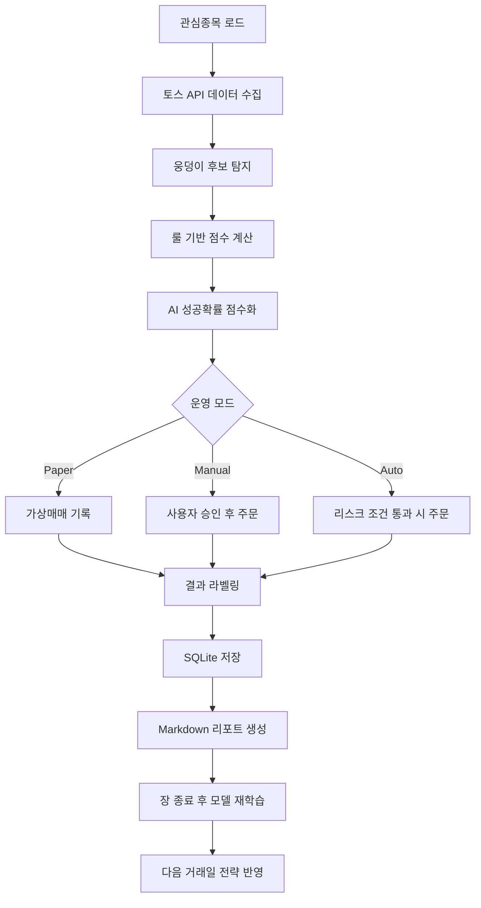

# PRD: CLI 기반 AI 학습형 웅덩이 단타 보조 시스템

문서 버전: v0.1  
작성일: 2026-06-24  
작성 목적: 토스증권 Open API 기반으로 관심종목의 단기 눌림/웅덩이 구간을 탐지하고, 가상매매 로그·AI 점수화·마크다운 리포트 축적을 통해 다음 매매 판단에 반영하는 CLI 프로그램의 제품 요구사항 정의

---

## 1. 제품 개요

### 1.1 제품명

**Puddle Trader CLI**

가칭이며, 실제 프로젝트명은 변경 가능하다.

### 1.2 한 줄 정의

> 관심종목을 순회 감시하면서 급락 후 저점이 잡히는 “웅덩이” 구간을 탐지하고, +0.5~1.0% 단기 반등을 목표로 가상매매·반자동매매·제한적 자동매매까지 확장하는 CLI 기반 매매 보조 시스템.

### 1.3 핵심 컨셉

본 시스템은 “AI가 알아서 매수/매도하는 자동 수익 봇”이 아니다.  
핵심은 아래 4가지다.

1. **관심종목 감시 자동화**
2. **웅덩이 후보 탐지**
3. **가상매매 로그 축적**
4. **데이터 기반 판단 기준 개선**

초기 버전에서는 실제 주문을 실행하지 않고, **가상매매 + 마크다운 리포트 + AI 점수화**까지 구현한다.  
실주문은 충분한 검증 이후 반자동 방식으로 확장한다.

---

## 2. 배경 및 문제 정의

### 2.1 현재 문제

사용자는 단타 매매 시 아래와 같은 판단 부담을 가지고 있다.

- 관심종목을 계속 직접 확인해야 한다.
- 웅덩이인지 하락 시작인지 구분하기 어렵다.
- 수익권에서는 더 먹고 싶어져 익절 타이밍이 흔들린다.
- 손실권에서는 반등 기대 때문에 손절이 늦어질 수 있다.
- 장세가 나쁜 날에도 진입 충동이 생긴다.
- 매매 결과가 체계적으로 기록되지 않아 다음 판단에 반영하기 어렵다.

### 2.2 해결 방향

시스템은 사용자의 감각적 판단을 아래와 같이 데이터화한다.

```text
감각적 판단:
"많이 빠졌고, 더 안 밀리는 것 같고, 반등 나올 것 같다."

데이터화:
- 최근 N분 하락률
- 직전 저점 이탈 여부
- 1분봉/5분봉 반등 여부
- 거래량 감소 후 회복 여부
- 호가 스프레드 안정 여부
- 목표 익절가와 손절가 중 무엇이 먼저 도달했는지
```

### 2.3 제품의 목적

이 제품의 1차 목적은 수익 극대화가 아니라 **매매 판단의 반복 가능성 확보**다.

구체적으로는:

- 진입 조건을 수치화한다.
- 수익/손실 결과를 자동 기록한다.
- 신호별 품질을 점수화한다.
- 매일 마크다운 리포트를 생성한다.
- 다음 거래일 판단 기준에 반영한다.
- 검증된 조건만 실거래로 승격한다.

---

## 3. 제품 목표와 비목표

### 3.1 목표

| 구분 | 목표 |
|---|---|
| G1 | CLI에서 관심종목을 등록하고 감시할 수 있다. |
| G2 | 토스증권 Open API로 현재가, 호가, 체결, 캔들 데이터를 수집한다. |
| G3 | “웅덩이 후보”를 룰 기반으로 탐지한다. |
| G4 | 탐지된 후보에 대해 AI/ML 점수를 계산한다. |
| G5 | 실제 주문 없이 가상매매 결과를 기록한다. |
| G6 | 신호, 진입, 익절, 손절, 시간청산 결과를 SQLite에 저장한다. |
| G7 | 매일 장 종료 후 마크다운 리포트를 생성한다. |
| G8 | 누적 데이터를 바탕으로 다음 매매 기준을 개선한다. |
| G9 | 검증 이후 반자동 주문과 제한적 자동매매로 확장 가능하게 설계한다. |

### 3.2 비목표

| 구분 | 비목표 |
|---|---|
| NG1 | 초고속 HFT/호가 스캘핑 시스템을 만들지 않는다. |
| NG2 | 뉴스, 커뮤니티 반응, SNS 감성 분석은 초기 범위에서 제외한다. |
| NG3 | AI가 단독으로 실주문을 실행하지 않는다. |
| NG4 | 손절 없는 물타기 전략을 지원하지 않는다. |
| NG5 | 모든 종목 자동 탐색은 초기 범위에서 제외한다. |
| NG6 | 장중 모델 재학습 후 즉시 실거래 반영은 지원하지 않는다. |
| NG7 | 수익률 보장을 제품 목표로 두지 않는다. |

---

## 4. API 전제 조건

### 4.1 공식 API 기준

토스증권 Open API는 국내(KRX) 및 미국 주식에 대한 REST API로 제공된다.  
주요 제공 범위는 다음과 같다.

- Auth: OAuth2 token issuance, JWKS
- Market Data: orderbook, prices, trades, price limits, candles
- Stock Info: stock master data, stock warnings
- Market Info: exchange rate, KR/US market calendar
- Account and Asset: accounts, holdings
- Order: create, modify, cancel, list, detail, buying power, sellable quantity, commissions

### 4.2 인증 전제

- Base API Server: `https://openapi.tossinvest.com`
- 인증 방식: OAuth 2.0 Client Credentials Grant
- 모든 API 호출은 access token을 사용한다.
- 계좌, 자산, 주문 관련 API는 `Authorization: Bearer {access_token}` 외에 `X-Tossinvest-Account` 헤더가 필요하다.
- 실제 엔드포인트 경로와 상세 스키마는 공식 OpenAPI JSON을 최종 기준으로 삼는다.

### 4.3 관심종목 전제

토스 앱에 사용자가 저장한 관심종목 목록을 공식 API로 직접 가져오는 기능은 초기 PRD 범위에서 사용하지 않는다.

따라서 관심종목은 CLI 내부에서 직접 관리한다.

```yaml
# favorites.yaml 예시
symbols:
  - market: KR
    code: "000660"
    name: "SK하이닉스"
    enabled: true
  - market: KR
    code: "005930"
    name: "삼성전자"
    enabled: true
  - market: US
    code: "NVDA"
    name: "NVIDIA"
    enabled: true
```

---

## 5. 사용자 시나리오

### 5.1 시나리오 A: 관심종목 웅덩이 감시

1. 사용자가 관심종목을 등록한다.
2. CLI가 장중 일정 주기로 관심종목을 순회한다.
3. 각 종목의 현재가, 캔들, 호가, 체결 데이터를 조회한다.
4. 최근 급락 후 저점 지지 조건을 검사한다.
5. 조건을 만족하면 “웅덩이 후보”로 표시한다.
6. 후보에 대해 진입 점수와 리스크 점수를 출력한다.
7. 실제 주문 없이 가상 진입을 기록한다.

### 5.2 시나리오 B: 가상매매 후 리포트 생성

1. 장중 발생한 모든 신호를 DB에 저장한다.
2. 신호 발생 시점의 가격, 호가, 거래량, 캔들 상태를 저장한다.
3. 진입 후 목표가 또는 손절가 중 어느 쪽이 먼저 도달했는지 기록한다.
4. 장 종료 후 `daily_report.md`를 자동 생성한다.
5. 성공/실패 패턴을 정리한다.
6. 다음 거래일의 제외 조건과 우선 조건을 제안한다.

### 5.3 시나리오 C: AI 점수화

1. 누적된 신호 데이터를 feature로 변환한다.
2. 각 신호에 `WIN`, `LOSS`, `TIMEOUT`, `WEAK_WIN` 라벨을 붙인다.
3. 모델을 학습한다.
4. 다음 장중 신호에 대해 성공 확률을 산출한다.
5. 성공 확률이 낮은 후보는 진입 제외로 표시한다.
6. 모델의 추천은 실주문 권한을 가지지 않는다.

### 5.4 시나리오 D: 반자동 주문

1. 웅덩이 후보가 발생한다.
2. 시스템이 예상 진입가, 익절가, 손절가, 최대 보유 시간을 출력한다.
3. 사용자가 CLI에서 `confirm` 명령을 입력해야 실제 주문이 나간다.
4. 주문 결과와 체결 상태를 기록한다.
5. 이후 익절/손절 조건은 자동 감시한다.

### 5.5 시나리오 E: 제한적 자동매매

1. 충분한 가상매매 검증을 통과한 전략만 자동매매 허용 상태가 된다.
2. 1회 진입금, 하루 손실 한도, 하루 진입 횟수를 제한한다.
3. 조건 충족 시 소액 자동 진입한다.
4. 익절, 손절, 시간청산은 규칙대로 실행한다.
5. 손실 한도 도달 시 자동매매가 정지된다.

---

## 6. 핵심 전략 정의

### 6.1 전략명

**Puddle Rebound Strategy**

### 6.2 전략 설명

관심종목 중 단기 급락 후 매도세가 약해지고, 저점 지지와 거래량 회복이 확인되는 지점을 “웅덩이”로 정의한다.  
진입 후 +0.5~1.0% 수준의 단기 반등을 목표로 하며, 실패 시 -0.4~0.7% 수준에서 손절한다.

### 6.3 기본 파라미터

| 항목 | 기본값 | 설명 |
|---|---:|---|
| Scan interval | 5초~30초 | 종목 순회 조회 주기 |
| Drop window | 5~20분 | 급락 판단 기간 |
| Drop threshold | -1.0%~-3.0% | 웅덩이 후보 하락률 |
| Take profit 1 | +0.5% | 1차 익절 또는 소익절 |
| Take profit 2 | +0.8%~+1.0% | 전량 익절 기준 |
| Stop loss | -0.4%~-0.7% | 손절 기준 |
| Max hold time | 10~20분 | 시간청산 기준 |
| Max daily entries | 3~5회 | 하루 최대 진입 횟수 |
| Max daily loss | 사용자 설정 | 일일 손실 한도 |
| Position size | 사용자 설정 | 1회 진입 금액 |

### 6.4 웅덩이 후보 조건

아래 조건 중 일정 개수 이상을 만족하면 웅덩이 후보로 분류한다.

| 조건 | 설명 |
|---|---|
| C1 | 최근 5~20분 사이 -1.0% 이상 하락 |
| C2 | 직전 저점을 즉시 이탈하지 않음 |
| C3 | 하락 캔들 거래량이 감소하거나 매도세 둔화 |
| C4 | 반등 캔들에서 거래량 회복 |
| C5 | 현재가가 1분봉 단기 이동평균 회복 |
| C6 | 현재가가 직전 1~3분 고점 돌파 |
| C7 | 호가 스프레드가 허용 범위 이내 |
| C8 | 매도호가를 먹는 체결이 증가 |
| C9 | 시장/지수 대용 종목이 급락 중이 아님 |
| C10 | 장 시작 직후 또는 마감 직전이 아님 |

### 6.5 제외 조건

아래 조건에 해당하면 웅덩이 후보에서 제외한다.

| 조건 | 설명 |
|---|---|
| E1 | 지수 대용 ETF가 5분봉 기준 급락 중 |
| E2 | 종목이 전고점 돌파 실패 후 재하락 |
| E3 | 호가 스프레드가 넓음 |
| E4 | 거래량은 큰데 가격이 오르지 못함 |
| E5 | 당일 고점권에서 하락이 시작됨 |
| E6 | 최근 N분 내 이미 같은 종목에서 손절 발생 |
| E7 | 하루 손실 한도 근접 |
| E8 | API 오류 또는 데이터 누락 발생 |
| E9 | 체결 가능성이 낮은 저유동성 종목 |
| E10 | 장 운영 시간이 아님 |

---

## 7. 시스템 아키텍처

### 7.1 전체 구조

```text
Puddle Trader CLI
├─ Config Layer
│  ├─ favorites.yaml
│  ├─ strategy.yaml
│  ├─ risk.yaml
│  └─ secrets
│
├─ Data Layer
│  ├─ Toss API Client
│  ├─ Candle Collector
│  ├─ Price Collector
│  ├─ Orderbook Collector
│  ├─ Trade Collector
│  └─ Market Calendar Checker
│
├─ Strategy Layer
│  ├─ Puddle Detector
│  ├─ Rebound Score Engine
│  ├─ Entry Filter
│  └─ Exit Rule Engine
│
├─ AI/ML Layer
│  ├─ Feature Builder
│  ├─ Label Builder
│  ├─ Model Trainer
│  ├─ Model Evaluator
│  └─ Prediction Scorer
│
├─ Trading Layer
│  ├─ Paper Trader
│  ├─ Manual Order Handler
│  ├─ Auto Order Executor
│  ├─ Position Manager
│  └─ Risk Manager
│
├─ Storage Layer
│  ├─ SQLite
│  ├─ CSV Export
│  └─ Markdown Reports
│
└─ CLI Layer
   ├─ watch
   ├─ scan
   ├─ paper
   ├─ train
   ├─ evaluate
   ├─ report
   ├─ manual
   ├─ auto
   └─ kill
```

### 7.2 처리 흐름



---

## 8. CLI 명령어 설계

### 8.1 초기 설정

```bash
tradebot init
```

기능:

- 프로젝트 폴더 생성
- 기본 설정 파일 생성
- SQLite DB 생성
- 로그 폴더 생성

생성 구조:

```text
tradebot/
├─ config/
│  ├─ favorites.yaml
│  ├─ strategy.yaml
│  ├─ risk.yaml
│  └─ app.yaml
├─ data/
│  └─ tradebot.sqlite
├─ logs/
├─ reports/
├─ models/
└─ exports/
```

### 8.2 인증 테스트

```bash
tradebot auth test
```

출력 예시:

```text
[AUTH] Access token issued successfully
[ACCOUNT] 1 account found
[STATUS] Ready
```

### 8.3 관심종목 관리

```bash
tradebot favorites add KR:000660 --name "SK하이닉스"
tradebot favorites add KR:005930 --name "삼성전자"
tradebot favorites list
tradebot favorites remove KR:005930
```

### 8.4 장중 감시

```bash
tradebot watch --mode paper --interval 10s
```

출력 예시:

```text
[10:14:25] SK하이닉스
현재가: 263,500
10분 하락률: -1.6%
저점 지지: YES
거래량 회복: YES
호가 안정: YES
웅덩이 점수: 78
AI 성공확률: 61%
판단: PAPER ENTRY
```

### 8.5 가상매매 실행

```bash
tradebot run --mode paper --strategy puddle
```

출력 예시:

```text
[PAPER BUY] SK하이닉스 263,500
TP1: 264,800 (+0.49%)
TP2: 266,100 (+0.99%)
SL: 262,100 (-0.53%)
MAX HOLD: 15m
```

### 8.6 학습

```bash
tradebot train --from data/tradebot.sqlite --target hit_tp_before_sl
```

### 8.7 평가

```bash
tradebot evaluate --last 30d
```

출력 예시:

```text
최근 30일 가상매매 결과

총 신호: 184
가상 진입: 52
승률: 57.6%
평균 수익: +0.71%
평균 손실: -0.48%
최대 연속 손실: 4회
최대 낙폭: -2.1%
자동매매 승인 상태: 보류
```

### 8.8 리포트 생성

```bash
tradebot report daily --date 2026-06-24
tradebot report weekly
tradebot report strategy --strategy puddle
```

### 8.9 긴급 정지

```bash
tradebot kill
```

기능:

- 자동매매 즉시 중지
- 신규 주문 차단
- 진행 중 주문 상태 확인
- 필요 시 미체결 주문 취소
- 상태를 `KILLED`로 기록

---

## 9. 운영 모드

### 9.1 Paper Mode

실제 주문 없이 가상매매만 수행한다.

기능:

- 가상 진입
- 가상 익절
- 가상 손절
- 시간청산
- 결과 라벨링
- 리포트 생성

초기 기본값은 반드시 `paper`로 설정한다.

### 9.2 Manual Mode

시스템은 진입 후보를 감지하고 주문안을 제시한다.  
사용자가 명령어로 승인해야 실제 주문이 실행된다.

```bash
tradebot approve signal_20260624_101425_000660
```

### 9.3 Auto Mode

검증된 전략만 소액 자동매매를 허용한다.

Auto Mode 진입 조건:

- 최근 20거래일 이상 가상매매 데이터 존재
- 최소 100개 이상 신호 기록
- 승률, 평균손익, 최대낙폭 기준 통과
- 최근 5거래일 성능 급락 없음
- 사용자가 명시적으로 auto mode 활성화
- risk.yaml에 주문 한도 설정 완료

---

## 10. 데이터 설계

### 10.1 주요 테이블

#### symbols

| 컬럼 | 타입 | 설명 |
|---|---|---|
| id | TEXT | 내부 식별자 |
| market | TEXT | KR/US |
| code | TEXT | 종목코드 |
| name | TEXT | 종목명 |
| enabled | BOOLEAN | 감시 여부 |
| created_at | DATETIME | 등록일 |

#### market_snapshots

| 컬럼 | 타입 | 설명 |
|---|---|---|
| id | TEXT | 스냅샷 ID |
| symbol_id | TEXT | 종목 ID |
| timestamp | DATETIME | 수집 시각 |
| price | REAL | 현재가 |
| change_rate | REAL | 등락률 |
| volume | INTEGER | 거래량 |
| bid_price | REAL | 최우선 매수호가 |
| ask_price | REAL | 최우선 매도호가 |
| spread_rate | REAL | 호가 스프레드 |
| raw_json | JSON | 원본 응답 |

#### candles

| 컬럼 | 타입 | 설명 |
|---|---|---|
| id | TEXT | 캔들 ID |
| symbol_id | TEXT | 종목 ID |
| interval | TEXT | 1m/3m/5m |
| timestamp | DATETIME | 캔들 시각 |
| open | REAL | 시가 |
| high | REAL | 고가 |
| low | REAL | 저가 |
| close | REAL | 종가 |
| volume | INTEGER | 거래량 |

#### signals

| 컬럼 | 타입 | 설명 |
|---|---|---|
| id | TEXT | 신호 ID |
| symbol_id | TEXT | 종목 ID |
| detected_at | DATETIME | 신호 발생 시각 |
| strategy | TEXT | 전략명 |
| entry_price | REAL | 기준 진입가 |
| puddle_score | REAL | 웅덩이 점수 |
| ai_score | REAL | AI 성공확률 |
| rule_passed | BOOLEAN | 룰 통과 여부 |
| decision | TEXT | WATCH/PAPER_ENTRY/SKIP |
| reason | TEXT | 판단 사유 |
| features_json | JSON | feature 데이터 |

#### paper_trades

| 컬럼 | 타입 | 설명 |
|---|---|---|
| id | TEXT | 가상매매 ID |
| signal_id | TEXT | 연결 신호 |
| entry_time | DATETIME | 가상 진입 시각 |
| entry_price | REAL | 가상 진입가 |
| tp1_price | REAL | 1차 익절가 |
| tp2_price | REAL | 최종 익절가 |
| sl_price | REAL | 손절가 |
| exit_time | DATETIME | 가상 청산 시각 |
| exit_price | REAL | 가상 청산가 |
| result | TEXT | WIN/LOSS/TIMEOUT/WEAK_WIN |
| pnl_rate | REAL | 수익률 |
| max_favorable | REAL | 최대 유리 변동 |
| max_adverse | REAL | 최대 불리 변동 |

#### model_predictions

| 컬럼 | 타입 | 설명 |
|---|---|---|
| id | TEXT | 예측 ID |
| signal_id | TEXT | 연결 신호 |
| model_version | TEXT | 모델 버전 |
| predicted_win_prob | REAL | 성공 확률 |
| threshold | REAL | 진입 허용 기준 |
| accepted | BOOLEAN | AI 기준 통과 여부 |
| created_at | DATETIME | 생성 시각 |

#### reports

| 컬럼 | 타입 | 설명 |
|---|---|---|
| id | TEXT | 리포트 ID |
| report_type | TEXT | daily/weekly/strategy |
| period_start | DATE | 시작일 |
| period_end | DATE | 종료일 |
| file_path | TEXT | 마크다운 경로 |
| summary_json | JSON | 요약 데이터 |
| created_at | DATETIME | 생성일 |

---

## 11. AI/ML 설계

### 11.1 AI 역할

AI는 주문자가 아니라 **신호 평가자**다.

AI가 할 일:

- 웅덩이 후보의 성공 확률 점수화
- 실패 가능성이 높은 패턴 감점
- 신호별 판단 근거 요약
- 장 종료 후 리포트 생성 보조
- 누적 결과 기반 전략 개선안 제안

AI가 하지 않을 일:

- 단독 실주문
- 손절 무시
- 장중 즉시 재학습 후 자동 반영
- 확률 근거 없는 매수/매도 지시

### 11.2 학습 목표

기본 학습 질문:

```text
진입 후 최대 보유시간 안에
+0.8~1.0% 목표가가 -0.4~0.7% 손절가보다 먼저 도달했는가?
```

### 11.3 라벨 정의

| 라벨 | 정의 |
|---|---|
| WIN | 목표 익절가가 손절가보다 먼저 도달 |
| LOSS | 손절가가 목표 익절가보다 먼저 도달 |
| TIMEOUT | 최대 보유시간 안에 익절/손절 모두 미도달 |
| WEAK_WIN | +0.3~0.5% 수익권 진입 후 약익절 또는 본전 청산 |
| INVALID | API 오류, 데이터 누락 등으로 평가 불가 |

### 11.4 Feature 후보

| 그룹 | Feature |
|---|---|
| 가격 | 최근 1분/3분/5분/10분 수익률 |
| 하락 | 최근 N분 최대 하락률 |
| 반등 | 저점 대비 반등률 |
| 캔들 | 양봉 전환 여부, 꼬리 길이, 몸통 비율 |
| 이동평균 | 1분봉 5MA/20MA 위치 |
| 거래량 | 최근 평균 대비 거래량 배율 |
| 호가 | 스프레드, 매수/매도 잔량 비율 |
| 체결 | 매도호가 체결 비중, 체결강도 유사 지표 |
| 시간 | 장 시작 후 경과 시간, 점심시간 여부 |
| 종목 | 평균 거래대금, 변동성 |
| 리스크 | 최근 동일 종목 손절 여부, 일일 손실 상태 |

### 11.5 모델 후보

MVP에서는 복잡한 딥러닝을 사용하지 않는다.

우선순위:

1. Logistic Regression
2. Random Forest
3. Gradient Boosting 계열
4. LightGBM/XGBoost는 추후 검토

초기에는 모델보다 **feature 품질과 라벨 정확도**가 더 중요하다.

### 11.6 학습 주기

| 시점 | 처리 |
|---|---|
| 장중 | 데이터 수집, 신호 탐지, 예측 점수 산출 |
| 장 종료 후 | 결과 라벨링, 일일 리포트 생성 |
| 야간 | 모델 재학습, 백테스트 |
| 다음 거래일 전 | 검증 통과 모델만 활성화 |

### 11.7 모델 게이트

자동매매에 사용되려면 아래 조건을 통과해야 한다.

| 조건 | 기준 예시 |
|---|---|
| 최소 신호 수 | 100개 이상 |
| 최소 진입 수 | 50개 이상 |
| 승률 | 55% 이상 |
| 평균 수익/손실 비율 | 1.1 이상 |
| 최대 연속 손실 | 5회 이하 |
| 최대 낙폭 | 설정 한도 이하 |
| 최근 5거래일 성능 | 급격한 저하 없음 |

---

## 12. 리스크 관리 요구사항

### 12.1 기본 원칙

자동매매 시스템의 핵심은 수익 로직보다 리스크 제한이다.

### 12.2 필수 리스크 규칙

| 규칙 | 설명 |
|---|---|
| R1 | 기본 실행 모드는 paper mode다. |
| R2 | 실주문은 명시적 활성화 없이는 실행되지 않는다. |
| R3 | AI 단독 주문은 금지한다. |
| R4 | 1회 최대 주문 금액을 제한한다. |
| R5 | 하루 최대 손실 한도를 설정한다. |
| R6 | 하루 최대 진입 횟수를 제한한다. |
| R7 | 한 종목 연속 재진입 쿨다운을 둔다. |
| R8 | 손절 후 즉시 복수 재진입을 제한한다. |
| R9 | API 오류 발생 시 신규 주문을 차단한다. |
| R10 | 체결 확인 전 중복 주문을 차단한다. |
| R11 | 장 운영 시간 외 주문을 차단한다. |
| R12 | 긴급 정지 명령어를 제공한다. |
| R13 | 모델 성능 저하 시 auto mode를 비활성화한다. |
| R14 | 손절 없는 물타기를 지원하지 않는다. |
| R15 | 모든 판단과 주문 시도를 로그로 남긴다. |

### 12.3 risk.yaml 예시

```yaml
mode:
  default: paper
  allow_manual_order: false
  allow_auto_order: false

capital:
  max_order_amount_krw: 300000
  max_daily_loss_krw: 100000
  max_daily_entries: 5
  max_symbol_entries_per_day: 2

exit:
  take_profit_1_rate: 0.005
  take_profit_2_rate: 0.009
  stop_loss_rate: -0.005
  max_hold_minutes: 15

cooldown:
  after_loss_minutes: 30
  after_trade_minutes: 10

safety:
  stop_on_api_error: true
  stop_on_consecutive_losses: 3
  require_manual_confirm_for_live_order: true
```

---

## 13. 마크다운 리포트 설계

### 13.1 리포트 목적

리포트는 단순 기록물이 아니라 다음 매매 판단을 개선하기 위한 학습 자산이다.

### 13.2 일일 리포트 파일명

```text
reports/daily/2026-06-24_daily_report.md
```

### 13.3 일일 리포트 구성

```markdown
# Daily Trading Report - 2026-06-24

## 1. 오늘 요약

- 총 감시 종목:
- 발생 신호:
- 가상 진입:
- WIN:
- LOSS:
- TIMEOUT:
- 평균 수익률:
- 평균 손실률:
- 최대 연속 손실:
- 자동매매 가능 여부:

## 2. 시장 상태 요약

- 코스피 대용 지표:
- 반도체 대용 지표:
- 환율:
- 장중 변동성:

## 3. 성공 신호 분석

| 시간 | 종목 | 점수 | 진입가 | 청산가 | 수익률 | 성공 요인 |
|---|---|---:|---:|---:|---:|---|

## 4. 실패 신호 분석

| 시간 | 종목 | 점수 | 진입가 | 청산가 | 손실률 | 실패 요인 |
|---|---|---:|---:|---:|---:|---|

## 5. 오늘의 패턴

### 잘 먹힌 조건

### 실패한 조건

### 제외해야 할 조건

## 6. 다음 거래일 반영사항

- 진입 기준 조정:
- 제외 조건 추가:
- 손절 기준 조정:
- 목표 익절 조정:
- 감시 종목 조정:

## 7. 원본 로그 링크

- signals:
- paper_trades:
- model_predictions:
```

### 13.4 전략 리포트

```text
reports/strategy/puddle_strategy_review_YYYY-MM-DD.md
```

포함 내용:

- 최근 30일 전략 성과
- 종목별 성과
- 시간대별 성과
- 하락률 구간별 성과
- 거래량 회복 조건별 성과
- AI 점수 구간별 성과
- 제외 조건 후보
- 실거래 승격 가능 여부

---

## 14. 기능 요구사항

### 14.1 FR-001 프로젝트 초기화

| 항목 | 내용 |
|---|---|
| 기능명 | 프로젝트 초기화 |
| 명령어 | `tradebot init` |
| 설명 | 기본 디렉토리, 설정 파일, DB를 생성한다. |
| 우선순위 | Must |
| 완료 기준 | 명령 실행 후 config/data/logs/reports/models 폴더가 생성된다. |

### 14.2 FR-002 인증 및 계좌 확인

| 항목 | 내용 |
|---|---|
| 기능명 | 토스 API 인증 |
| 명령어 | `tradebot auth test` |
| 설명 | API 키/시크릿으로 access token 발급 여부를 확인한다. |
| 우선순위 | Must |
| 완료 기준 | 토큰 발급 성공 여부와 계좌 조회 가능 여부를 출력한다. |

### 14.3 FR-003 관심종목 관리

| 항목 | 내용 |
|---|---|
| 기능명 | 관심종목 등록/삭제/조회 |
| 명령어 | `tradebot favorites` |
| 설명 | 앱 내부 관심종목 리스트를 관리한다. |
| 우선순위 | Must |
| 완료 기준 | favorites.yaml에 종목이 저장되고 watch 대상이 된다. |

### 14.4 FR-004 시세 데이터 수집

| 항목 | 내용 |
|---|---|
| 기능명 | 현재가/캔들/호가/체결 수집 |
| 명령어 | `tradebot watch` |
| 설명 | 관심종목별 시장 데이터를 수집한다. |
| 우선순위 | Must |
| 완료 기준 | 수집 데이터가 SQLite에 저장된다. |

### 14.5 FR-005 웅덩이 후보 탐지

| 항목 | 내용 |
|---|---|
| 기능명 | Puddle Detector |
| 설명 | 급락 후 저점 지지와 반등 조건을 검사한다. |
| 우선순위 | Must |
| 완료 기준 | 조건 충족 시 signal record가 생성된다. |

### 14.6 FR-006 가상매매

| 항목 | 내용 |
|---|---|
| 기능명 | Paper Trader |
| 설명 | 실제 주문 없이 진입/청산 결과를 시뮬레이션한다. |
| 우선순위 | Must |
| 완료 기준 | WIN/LOSS/TIMEOUT 라벨이 기록된다. |

### 14.7 FR-007 리포트 생성

| 항목 | 내용 |
|---|---|
| 기능명 | Markdown Report Generator |
| 설명 | 일일/주간/전략 리포트를 생성한다. |
| 우선순위 | Must |
| 완료 기준 | reports 폴더에 md 파일이 생성된다. |

### 14.8 FR-008 AI 점수화

| 항목 | 내용 |
|---|---|
| 기능명 | AI/ML Scoring |
| 설명 | 신호별 성공 확률을 계산한다. |
| 우선순위 | Should |
| 완료 기준 | model_predictions 테이블에 점수가 저장된다. |

### 14.9 FR-009 모델 학습

| 항목 | 내용 |
|---|---|
| 기능명 | Model Training |
| 명령어 | `tradebot train` |
| 설명 | 누적된 가상매매 데이터를 기반으로 모델을 학습한다. |
| 우선순위 | Should |
| 완료 기준 | models 폴더에 모델 파일과 평가 결과가 저장된다. |

### 14.10 FR-010 반자동 주문

| 항목 | 내용 |
|---|---|
| 기능명 | Manual Order |
| 설명 | 사용자가 승인한 신호에 한해 실제 주문을 실행한다. |
| 우선순위 | Could |
| 완료 기준 | 명시적 승인 없이 주문이 나가지 않는다. |

### 14.11 FR-011 제한적 자동매매

| 항목 | 내용 |
|---|---|
| 기능명 | Auto Trading |
| 설명 | 모델 게이트와 리스크 조건을 통과한 경우 소액 자동 주문한다. |
| 우선순위 | Later |
| 완료 기준 | 자동매매 허용 조건 불충족 시 주문이 차단된다. |

---

## 15. 비기능 요구사항

### 15.1 안정성

- API 오류 시 신규 주문을 차단해야 한다.
- 네트워크 장애 발생 시 시스템 상태를 `DEGRADED`로 기록해야 한다.
- DB 쓰기 실패 시 주문을 실행하지 않아야 한다.
- 중복 신호 및 중복 주문을 방지해야 한다.

### 15.2 보안

- API 키와 시크릿은 코드에 하드코딩하지 않는다.
- `.env` 또는 macOS Keychain 사용을 기본으로 한다.
- 로그에 API 키, 시크릿, access token을 기록하지 않는다.
- 리포트에는 민감 계좌번호 전체를 노출하지 않는다.
- Git 저장소에는 secrets 파일을 포함하지 않는다.

### 15.3 성능

- 관심종목 수가 20개 이하일 때 안정적으로 동작해야 한다.
- polling interval은 API rate limit을 고려하여 조정 가능해야 한다.
- 모든 API 호출은 timeout과 retry 정책을 가져야 한다.
- 장중 데이터 저장은 비동기 또는 배치 방식으로 처리한다.

### 15.4 추적성

- 모든 신호는 고유 ID를 가진다.
- 모든 가상 진입과 청산은 연결된 signal ID를 가진다.
- 모든 실주문은 판단 근거, 요청, 응답을 기록한다.
- 모델 버전과 예측 결과를 함께 저장한다.

---

## 16. 오류 및 예외 처리

| 상황 | 처리 |
|---|---|
| Access token 만료 | 자동 재발급 시도 |
| 인증 실패 | 프로그램 정지, 주문 차단 |
| 계좌 헤더 누락 | 계좌 API/주문 API 실행 차단 |
| API rate limit | 대기 후 재시도, 심하면 watch interval 증가 |
| 현재가 누락 | 해당 종목 신호 평가 제외 |
| 캔들 데이터 부족 | 해당 종목 신호 평가 제외 |
| 호가 조회 실패 | 호가 조건 제외가 아니라 진입 차단 |
| 주문 요청 실패 | 주문 실패 기록, 재시도는 수동 확인 후 |
| 부분 체결 | 체결 수량 기준으로 포지션 재계산 |
| 미체결 장기 지속 | 설정 시간 초과 시 취소 |
| 장 운영 시간 아님 | 신규 진입 차단 |
| 긴급 정지 | 모든 자동 로직 중단 |

---

## 17. MVP 범위

### 17.1 v0.1 - CLI 가상매매

목표: 실주문 없이 웅덩이 탐지와 가상매매 로그를 축적한다.

포함:

- 프로젝트 초기화
- API 인증 테스트
- 관심종목 관리
- 현재가/캔들/호가 수집
- 웅덩이 후보 탐지
- 가상매매
- SQLite 저장
- 일일 마크다운 리포트

제외:

- 실주문
- AI 학습
- 자동매매
- UI 앱

### 17.2 v0.2 - AI 점수화 및 학습

포함:

- feature builder
- label builder
- 모델 학습
- 모델 평가
- 신호별 성공 확률 출력
- AI 점수별 성과 리포트

### 17.3 v0.3 - 반자동 주문

포함:

- 매수 가능 금액 조회
- 주문 수량 계산
- 사용자가 승인한 주문 실행
- 체결 확인
- 보유 포지션 감시
- 수동 청산 명령

### 17.4 v0.4 - 제한적 자동 익절/손절

포함:

- 실제 진입 후 자동 익절
- 실제 진입 후 자동 손절
- 시간청산
- 일일 손실 한도
- 긴급 정지

### 17.5 v0.5 - 제한적 자동진입

포함:

- 모델 게이트 통과 신호만 소액 자동진입
- 일일 자동매매 리포트
- 성능 저하 시 자동 비활성화

---

## 18. 성공 지표

### 18.1 제품 지표

| 지표 | 목표 |
|---|---|
| 장중 데이터 수집 성공률 | 95% 이상 |
| 신호 기록 누락률 | 1% 이하 |
| 리포트 자동 생성 성공률 | 95% 이상 |
| 가상매매 라벨링 성공률 | 95% 이상 |
| 중복 주문 방지 | 100% |

### 18.2 전략 검증 지표

| 지표 | 검토 기준 |
|---|---|
| 총 신호 수 | 최소 100개 이상 |
| 가상 진입 수 | 최소 50개 이상 |
| 승률 | 55% 이상이면 긍정 검토 |
| 평균 수익률 | 평균 손실률보다 높아야 함 |
| 최대 연속 손실 | 5회 이하 |
| 최대 낙폭 | 사용자 허용범위 이하 |
| 시간대별 편차 | 특정 시간대만 작동하면 제한 필요 |
| 종목별 편차 | 특정 종목 의존도가 높으면 위험 |
| AI 점수 구간별 성과 | 높은 점수 구간이 실제로 더 좋아야 함 |

### 18.3 자동매매 승격 기준

자동매매는 아래 조건을 모두 만족할 때만 검토한다.

- 최근 20거래일 이상 데이터 존재
- 최소 100개 이상 신호
- 최소 50개 이상 가상진입
- 수수료/세금/슬리피지 반영 후 기대값 양수
- 최근 5거래일 성능 급락 없음
- 최대 연속 손실이 설정 한도 이하
- 사용자가 수동으로 auto mode 활성화

---

## 19. 테스트 계획

### 19.1 단위 테스트

- 웅덩이 탐지 조건 계산
- 익절/손절 가격 계산
- 시간청산 판단
- feature 생성
- label 생성
- 리스크 한도 계산
- 중복 신호 방지

### 19.2 통합 테스트

- API 인증 → 데이터 수집 → 신호 생성 → 가상매매 → 리포트 생성
- 신호 발생 → AI 점수화 → DB 저장
- manual mode 주문 전 승인 플로우
- kill command 실행 시 자동매매 중지

### 19.3 운영 테스트

- 장중 3시간 이상 paper mode 실행
- 관심종목 10개 이상 동시 감시
- 네트워크 장애 시뮬레이션
- API 응답 지연 시뮬레이션
- DB write 실패 시뮬레이션
- 장 종료 후 리포트 생성 검증

---

## 20. 개발 스택 제안

### 20.1 1안: Python 중심

| 영역 | 기술 |
|---|---|
| CLI | Typer 또는 Click |
| HTTP Client | httpx |
| DB | SQLite + SQLAlchemy |
| ML | scikit-learn |
| Report | Markdown 템플릿 |
| Config | YAML |
| Secret | `.env`, macOS Keychain 추후 |
| Scheduling | APScheduler |

장점:

- 빠르게 만들 수 있다.
- 데이터 분석과 ML 구현이 쉽다.
- CLI MVP에 적합하다.

단점:

- macOS 앱 UI 확장 시 별도 작업 필요.
- 배포 패키징 관리가 필요하다.

### 20.2 2안: TypeScript 중심

| 영역 | 기술 |
|---|---|
| CLI | Node.js + Commander |
| HTTP Client | axios/fetch |
| DB | SQLite |
| ML | Python 연동 또는 JS ML 라이브러리 |
| Report | Markdown 템플릿 |
| Config | YAML/JSON |

장점:

- 추후 Tauri/React UI로 확장하기 쉽다.
- 프론트엔드와 같은 언어로 유지 가능하다.

단점:

- ML/데이터 분석은 Python보다 번거롭다.

### 20.3 추천

초기 MVP는 **Python CLI**를 추천한다.

이유:

- 토스 API 연결 테스트가 빠르다.
- 가상매매 로그 분석이 쉽다.
- scikit-learn으로 모델 실험이 쉽다.
- Markdown 리포트 생성이 간단하다.

추후 UI가 필요하면 Tauri/React로 별도 프론트엔드를 붙이고, Python 엔진을 백엔드처럼 운용한다.

---

## 21. 설정 파일 예시

### 21.1 strategy.yaml

```yaml
strategy:
  name: puddle_rebound
  enabled: true

scan:
  interval_seconds: 10
  candle_intervals:
    - "1m"
    - "5m"

puddle:
  drop_window_minutes: 10
  min_drop_rate: -0.012
  max_drop_rate: -0.035
  require_low_support: true
  require_volume_recovery: true
  require_orderbook_stable: true

entry:
  min_puddle_score: 70
  min_ai_score: 0.58
  allow_without_ai: true

exit:
  take_profit_1_rate: 0.005
  take_profit_2_rate: 0.009
  stop_loss_rate: -0.005
  max_hold_minutes: 15
```

### 21.2 app.yaml

```yaml
app:
  timezone: Asia/Seoul
  database_path: data/tradebot.sqlite
  reports_path: reports
  logs_path: logs

api:
  provider: tossinvest
  base_url: https://openapi.tossinvest.com
  timeout_seconds: 5
  retry_count: 2
  retry_backoff_seconds: 1

logging:
  level: INFO
  mask_secrets: true
```

---

## 22. 향후 확장

### 22.1 macOS 앱화

CLI가 안정화된 후 Tauri 기반 UI를 붙일 수 있다.

화면 후보:

- 관심종목 스캐너
- 웅덩이 후보 랭킹
- 가상매매 성과 대시보드
- 일일 리포트 뷰어
- 전략 설정 화면
- 리스크 설정 화면
- 실시간 포지션 화면

### 22.2 외부 데이터 확장

초기 범위에서는 제외하지만, 추후 필요 시 아래를 검토한다.

- KRX 시장 데이터
- DART 공시
- 환율/금리/미국 선물
- 뉴스 헤드라인
- 지수/ETF 대용 시장 필터
- 종목별 변동성 랭킹

### 22.3 전략 확장

- 돌파 전략
- VWAP 회복 전략
- 장초반 변동성 전략
- 반도체 섹터 전용 전략
- ETF 롱/인버스 전환 전략

---

## 23. 개발 우선순위

### Phase 1: API 연결과 로그

1. 프로젝트 초기화
2. 인증 테스트
3. 관심종목 등록
4. 현재가/캔들 수집
5. SQLite 저장

### Phase 2: 웅덩이 탐지

1. 급락 조건 계산
2. 저점 지지 계산
3. 거래량 회복 계산
4. 호가 안정 계산
5. 웅덩이 점수 출력

### Phase 3: 가상매매

1. 가상 진입
2. 목표가/손절가 계산
3. 장중 청산 판단
4. WIN/LOSS/TIMEOUT 라벨링
5. 일일 리포트 생성

### Phase 4: AI 학습

1. feature builder
2. label builder
3. train command
4. evaluate command
5. model_predictions 저장

### Phase 5: 주문 확장

1. 매수 가능 금액 조회
2. 주문 수량 계산
3. manual mode 주문
4. 자동 익절/손절
5. 제한적 auto mode

---

## 24. 개발자에게 전달할 핵심 원칙

1. **기본 모드는 무조건 paper mode다.**
2. **AI는 신호 점수화만 담당하고 실주문 권한을 갖지 않는다.**
3. **실주문은 manual mode부터 시작한다.**
4. **auto mode는 별도 설정과 성능 조건을 통과해야 한다.**
5. **모든 판단 근거는 DB와 MD 리포트에 남긴다.**
6. **API 오류, 데이터 누락, 장 운영시간 외 상황에서는 주문하지 않는다.**
7. **손절 없는 물타기 기능은 만들지 않는다.**
8. **수익률보다 최대 손실과 연속 손실 관리가 우선이다.**
9. **관심종목은 토스 앱에서 가져오지 않고 앱 내부 YAML로 관리한다.**
10. **공식 OpenAPI JSON을 최종 명세 기준으로 삼는다.**

---

## 25. 참고 문서

- 토스증권 Open API 가이드: https://developers.tossinvest.com/docs
- AI/non-JavaScript fetcher용 안내: https://developers.tossinvest.com/llms.txt
- OpenAPI Overview Markdown: https://openapi.tossinvest.com/openapi-docs/overview.md
- OpenAPI API Reference Markdown: https://openapi.tossinvest.com/openapi-docs/latest/api-reference/README.md
- OpenAPI JSON Source of Truth: https://openapi.tossinvest.com/openapi-docs/latest/openapi.json

---

## 26. 최종 요약

본 PRD는 사용자의 “관심종목 웅덩이 매수 후 1% 내외 익절” 방식을 CLI 프로그램으로 데이터화하기 위한 문서다.

핵심 방향은 아래와 같다.

```text
관심종목 감시
→ 웅덩이 후보 탐지
→ 가상매매
→ 결과 라벨링
→ 마크다운 리포트 축적
→ AI 점수화
→ 다음 매매 기준 개선
→ 반자동 주문
→ 제한적 자동매매
```

초기 목표는 자동으로 돈을 버는 것이 아니라,  
**반복 가능한 판단 기준과 검증 가능한 매매 로그를 만드는 것**이다.

검증된 데이터가 충분히 쌓이면, 그때부터 소액 반자동 주문과 제한적 자동 익절/손절로 확장한다.
